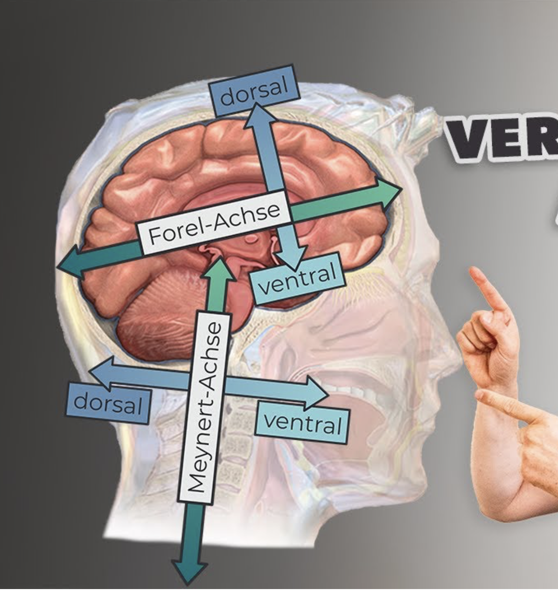
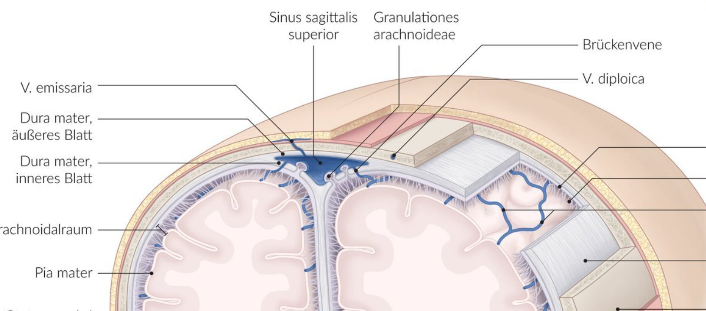

# Nochmal angucken vor der Müprü

## Anatomie

### Blut-Liquor-Schranke

1. fenestriertes Kapillarendothel
2. Basalmembran
3. Neurothel im Liquorraum **oder** Plexusepithel in den Ventrikeln

### Blut-Hirn-Schranke

1. fenestriertes Kapillarendothel
2. Basalmembran
3. Perizyten- und **Astrozyten**fortsätze

-> Besonderheit von Perizyten im Gehirn: können Phagozytose

### Plexusepithel

- Ependymzellen (Gliazellen), einschichtig kubisch
- Mikrovilli zur Resorption
- Kinozilien zum Liquortransport
- Zonulae adhaerentes und Tight junctions

### Neurothel

epitheloide Zellverbände aus modifizierten Fibroblasten

### Epiduralblutung

Gehirn: Normalerweise kein Epiduralraum, bei Epiduralblutung kommt es zum Ablösen der Dura mater vom Knochen -> pathologischer blutgefüllter Epiduralraum

### 3. Ventrikel

### 4. Ventrikel

#### Begrenzungen

- **ventral**: Rautengrube (fossa rhomboidea)
- **dorsokranial**: Velum medullare superius und inferius (Kleinhirnsegel)
- **lateral**: Kleinhirnstiele

### Forel- und Meynert-Achse

### Brückenvenen

Sind Verbindungen zwischen *Vv. superficiales cerebri* und *Sinus durae matris* und **durchbrechen die Dura mater!**

### Granulationes arachnoideae

Sind Aussackungen der **Arachnoidea** wölben aber auch die **Dura mater in die Sinus** rein.

### N. olfactorius

Die Lamina cribrosa liegt im **Os ethmoidale**.

1. Neuron: Sinneszellen der Riechschleimhaut
2. Neuron: Bulbus olfactorius

### N. oculomotorius

... bekannte Aufallsymptome

- Blick nach unten (durch intakten M. obliquus superior) und außen (durch intakten M. rectus lateralis)

### Faserqualitäten

- N. olfactorius (I): **Speziell viszeroafferent**
- N. opticus (II): **Speziell somatoafferent**
