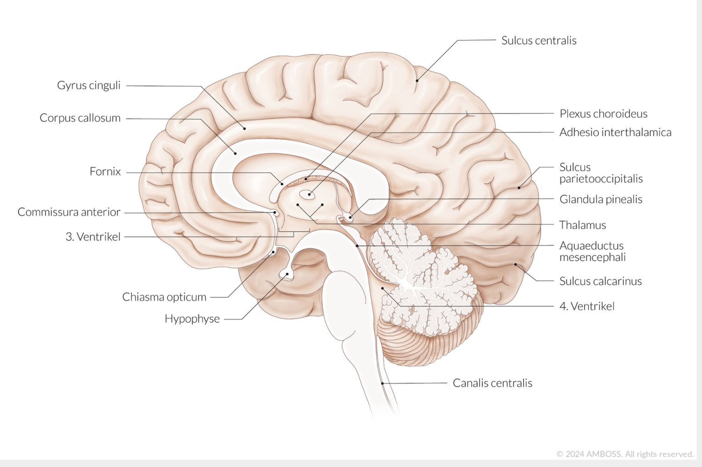
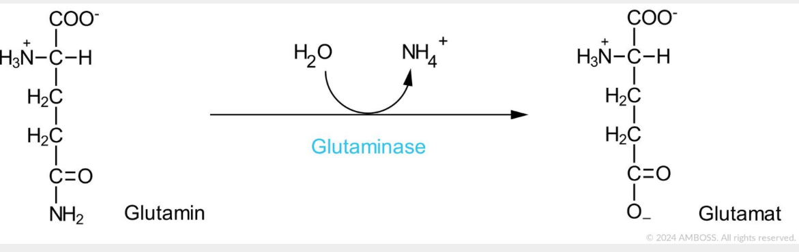

# Nochmal angucken vor der Müprü

## Anatomie

### Blut-Liquor-Schranke

1. fenestriertes Kapillarendothel
2. Basalmembran
3. Neurothel im Liquorraum **oder** Plexusepithel in den Ventrikeln

### Blut-Hirn-Schranke

1. fenestriertes Kapillarendothel
2. Basalmembran
3. Perizyten- und **Astrozyten**fortsätze

-> Besonderheit von Perizyten im Gehirn: können Phagozytose

### Plexusepithel

- Ependymzellen (Gliazellen), einschichtig kubisch
- Mikrovilli zur Resorption
- Kinozilien zum Liquortransport
- Zonulae adhaerentes und Tight junctions

### Neurothel

epitheloide Zellverbände aus modifizierten Fibroblasten

### Epiduralblutung

Gehirn: Normalerweise kein Epiduralraum, bei Epiduralblutung kommt es zum Ablösen der Dura mater vom Knochen -> pathologischer blutgefüllter Epiduralraum

### 3. Ventrikel

### 4. Ventrikel

#### Begrenzungen

- **ventral**: Rautengrube (fossa rhomboidea)
- **dorsokranial**: Velum medullare superius und inferius (Kleinhirnsegel)
- **lateral**: Kleinhirnstiele

### Forel- und Meynert-Achse

### Brückenvenen

Sind Verbindungen zwischen *Vv. superficiales cerebri* und *Sinus durae matris* und **durchbrechen die Dura mater!**

### Granulationes arachnoideae

Sind Aussackungen der **Arachnoidea** wölben aber auch die **Dura mater in die Sinus** rein.

### N. olfactorius

Die Lamina cribrosa liegt im **Os ethmoidale**.

1. Neuron: Sinneszellen der Riechschleimhaut
2. Neuron: Bulbus olfactorius

### N. oculomotorius

... bekannte Aufallsymptome

- Blick nach unten (durch intakten M. obliquus superior) und außen (durch intakten M. rectus lateralis)

### N. abducens

Pons -> Sulcus bulbopontinus (zwischen Medulla oblongata und Pons) -> am Clivus in Dura -> in sinus cavernosus -> fissura orbitalis superior

### Faserqualitäten

- N. olfactorius (I): **Speziell viszeroafferent**
- N. opticus (II): **Speziell somatoafferent**
- N. oculomotorius (III): **Allgemein somatoefferent** und **Allgemein viszeroefferent**
- N. vestibulocochlearis (VIII): **Speziell somatoafferent**
- N. accessorius (XI): **Allgemein somatoefferent** (Sternocleido und Trapezius) und **Speziell somatoefferent** (Kehlkopfmuskeln)

## Biochemie

### Trypsin

Ist eine Serinprotease und gehört zu den Endopeptidasen. 
Serinprotease: Katalytische Triade aus **Serin, Histidin & Aspartat**.
🚨 **Spaltet aber immer hinter basischen Aminosäuren Arginin oder Lysin**

### PKA,B,C

Sind **Serin/Threonin** Kinasen.

### Aminosäuren

Alle proteinogenen AS haben am alpha-C-Atom ein **Chiralitätszentrum** und liegen in L-Form vor, d.h. die Aminogruppe liegt links vom alpha-C-Atom.

### Harnstoffzyklus

Ziel: Ausscheidung von **Stickstoff!!**

Aktivierung durch: **N-Acetylglutamat**. 
Je mehr Glutamat/Acetyl-CoA vorhanden, desto mehr N-Acetylglutamat!

### Transaminierungsreaktionen

Transaminase: Übertragen Aminogruppe von AS auf alpha-Ketosäure.
Reaktion: **AS + alpha-Ketosäure -> neue AS + neue alpha-Ketosäure**

alpha-Ketosäuren Beispiele: alpha-Ketoglutarat, Oxalacetat, Brenztraubensäure (Anion ist Pyruvat).

### Desaminierungen

Eliminierende Desaminierung: Abspaltung der Aminogruppe in Form von Ammoniak unter **Abspaltung von Wasser**.

Hydrolytische Desaminierung: Abspaltung der Aminogruppe in Form von Ammoniak unter **Einbau von Wasser**.
Beispiele: **Glutaminase** & Asparaginase -> irreversibel

### Peptidbindung = "Amidbindung"

Peptidbindungen werden am **Ribosom** verknüpft!

### Proteasom

besitzt ATP-abhängigen Proteasekomplex. Der aus den Untereinheiten

- 20S-UE: Unspezifische **Peptidase**aktivität
- zwei 19S-UEinheiten: Spalten Ubiquitinmoleküle ab

### Querbrückenzyklus

**Myosin-ATPase**: Spaltet ATP -> ADP + Pi um Mosin vorzuspannen

### Denaturierung

Protein verliert Struktur (Quartär,tertiär,sekundär) und wird zur Primärstruktur.

Wenn ein Protein nach Spaltung durch Peptidasen usw. noch Oligopeptid ist, wird es durch Bürstensaumständige Oligopeptidase zu Di- und Tripeptide gespalten.
