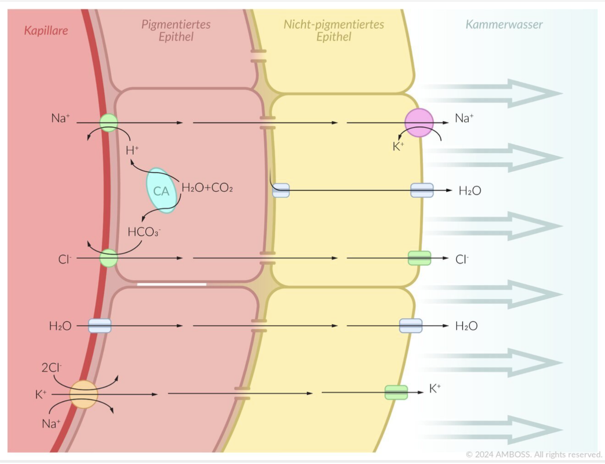
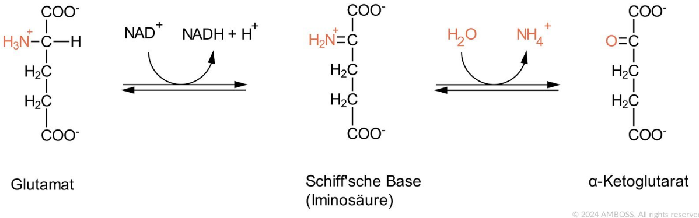
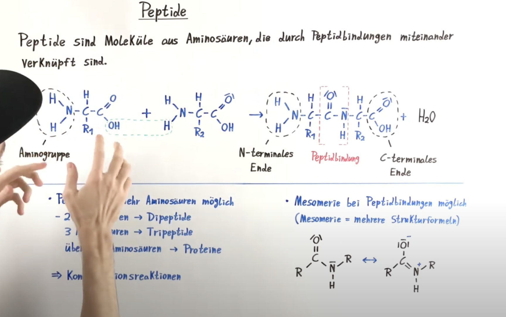

# Nochmal angucken vor der Müprü

[ ] Aktionspotential Schrittmacherzelle Herz Kurve
[ ] Aktionspotential Arbeitsmyokard Kurve
[ ] Gleichgewichtspotentiale für die Ionen nachgucken
[ ] Bild angucken 
[ ] Bild angucken 
[ ] Bild angucken 
[ ] Bild angucken 
[ ] Bild angucken 
[ ] Bild angucken 
[ ] Bild angucken 
[ ] Bild angucken 
[ ] Wie wird entschieden ob Ammoniak ausgeschieden oder fixiert wird?

## Anatomie

### Nicht-autochthone Rückenmuskulatur

Die nicht-autochthonen Muskeln entstehen in der Embryonalentwicklung primär am Kopf und den Extremitäten und wandern erst sekundär auf den Rücken. Man spricht deshalb auch von der sekundären Rückenmuskulatur.

### Corpus adiposum preepiglotticae

Respirationstrakt beim Schluckakt verschlossen wird (Stichwort Corpus adiposum preepiglottica).

### Sinus maxillaris

Der Sinus maxillaris mündet indirekt in den mittleren Nasengang. Über den Hiatus maxillaris gelangt das Sekret in das Infundibulum ethmoidale und von dort aus in den mittleren Nasengang.

### Fossa infratemporalis

Enthält das **Ganglion oticum**!

### Blut-Liquor-Schranke

1. fenestriertes Kapillarendothel
2. Basalmembran
3. Neurothel im Liquorraum **oder** Plexusepithel in den Ventrikeln

### Blut-Hirn-Schranke

1. fenestriertes Kapillarendothel
2. Basalmembran
3. Perizyten- und **Astrozyten**fortsätze

-> Besonderheit von Perizyten im Gehirn: können Phagozytose

### Plexusepithel

- Ependymzellen (Gliazellen), einschichtig kubisch
- Mikrovilli zur Resorption
- Kinozilien zum Liquortransport
- Zonulae adhaerentes und Tight junctions

### Neurothel

epitheloide Zellverbände aus modifizierten Fibroblasten

### Epiduralblutung

Gehirn: Normalerweise kein Epiduralraum, bei Epiduralblutung kommt es zum Ablösen der Dura mater vom Knochen -> pathologischer blutgefüllter Epiduralraum

### 3. Ventrikel

### 4. Ventrikel

#### Begrenzungen

- **ventral**: Rautengrube (fossa rhomboidea)
- **dorsokranial**: Velum medullare superius und inferius (Kleinhirnsegel)
- **lateral**: Kleinhirnstiele

### Forel- und Meynert-Achse

### Brückenvenen

Sind Verbindungen zwischen *Vv. superficiales cerebri* und *Sinus durae matris* und **durchbrechen die Dura mater!**

### Granulationes arachnoideae

Sind Aussackungen der **Arachnoidea** wölben aber auch die **Dura mater in die Sinus** rein.

### N. olfactorius

Die Lamina cribrosa liegt im **Os ethmoidale**.

1. Neuron: Sinneszellen der Riechschleimhaut
2. Neuron: Bulbus olfactorius

### N. oculomotorius

... bekannte Aufallsymptome

- Blick nach unten (durch intakten M. obliquus superior) und außen (durch intakten M. rectus lateralis)

### N. trigeminus (V)

N. mandibularis: u.a. Speziell viszeroefferent (Kaumuskulatur) → Ncl. motorius n. trigemini

### N. abducens (6)

Pons -> Sulcus bulbopontinus (zwischen Medulla oblongata und Pons) -> am Clivus in Dura -> in sinus cavernosus -> fissura orbitalis superior

### Faserqualitäten

- N. olfactorius (I): **Speziell viszeroafferent**
- N. opticus (II): **Speziell somatoafferent**
- N. oculomotorius (III): **Allgemein somatoefferent** und **Allgemein viszeroefferent**
- N. vestibulocochlearis (VIII): **Speziell somatoafferent**
- N. accessorius (XI): **Allgemein somatoefferent** (Sternocleido und Trapezius) und **Speziell somatoefferent** (Kehlkopfmuskeln)
- N. vagus (X): Ncl. dorsalis n. vagi ist **allgemein viszeroefferent**

### N. facialis

**M. stapedius** darf nicht vergessen werden!!!

### N. glossopharyngeus

④ Unterhalb Foramen jugulare: Ganglion inferius n. glossopharyngei
⑤ Zieht zwischen der **A. carotis interna und V. jugularis interna** sowie hinter dem **M. stylopharyngeus** zur Zunge und gibt folgende Äste ab

- N. tympanicus → Bildet Plexus tympanicus
- R. tubarius: Sensible Innervation der Tuba auditiva
- N. petrosus minor (aus Plexus tympanicus) → Ganglion oticum → Parasympathisch Gl. parotis, buccales und labiales

### N. vagus

Zieht durch mediastium **posterius**.

### N. hypoglossus

Verläuft zwischen: **M. mylohyoideus & M. hyoglossus** und zweigt sich dort in seine Äste auf.

### Basalganglien

Striatum → Nucleus caudatus & Putamen

### A. carotis interna

Gibt **A. communicans posterior** (in ihrem pars cerebralis) ab!

## Biochemie

### Definition Biotransformation

Biotransformation = Umwandlung von apolaren, lipophilen Stoffen in polare, wasserlösliche Stoffe.

### Depurinierung

Thermische Spaltung der N-glykosidischen Bindung zwischen Desoxyribose & Purinbasen.

### Knallgasreaktion

Die Knallgasreaktion ist eine exotherme Reaktion, bei der Wasserstoff und Sauerstoff unter Freisetzung von Wärme und Licht zu Wasser reagieren.

### Polymerasen

Polymerase δ: Synthese des Folgestrangs | Polymerase ε: Synthese des Leitstrangs

### Cytochrom C

Bestandteile:

- Aminosäuren (ist ein Protein)
- Häm-Gruppe
- Eisenion an Häm gebunden

Kann Apoptose einleiten. Essentiell für die Atmungskette.

### Ubichinon

Ist ein **Chinon-Derivat** mit **isoprenoider Seitenkette**.
Es ist wichtig für den Elektronentransfer.

### Trypsin

Ist eine Serinprotease und gehört zu den Endopeptidasen.
Serinprotease: Katalytische Triade aus **Serin, Histidin & Aspartat**.
🚨 **Spaltet aber immer hinter basischen Aminosäuren Arginin oder Lysin**

### PKA,B,C

Sind **Serin/Threonin** Kinasen.

### Aminosäuren

Alle proteinogenen AS haben am alpha-C-Atom ein **Chiralitätszentrum** und liegen in L-Form vor, d.h. die Aminogruppe liegt links vom alpha-C-Atom.

### Abbau von Aminosäuren

Zwei Varianten

- Übertragen (Transaminierung) bzw. Abspalten der Aminogruppe (Desaminierung)
- Abspalten der Carboxylgruppe (Decarboxylierung)

### Transaminierungsreaktionen

Transaminase: Übertragen Aminogruppe von AS auf alpha-Ketosäure.
Reaktion: **AS + alpha-Ketosäure -> neue AS + neue alpha-Ketosäure**

alpha-Ketosäuren Beispiele: alpha-Ketoglutarat, Oxalacetat, Brenztraubensäure (Anion ist Pyruvat).

### Desaminierungen

#### Eliminierende Desaminierung

Abspaltung der Aminogruppe in Form von Ammoniak unter **Abspaltung von Wasser**.

#### Hydrolytische Desaminierung

Abspaltung der Aminogruppe in Form von Ammoniak unter **Einbau von Wasser**.
Beispiele: **Glutaminase** & Asparaginase -> irreversibel

#### Oxidative Desaminierung

Abspaltung der Aminogruppe nach vorheriger **Oxidation der Aminosäure**.
**Aminogruppe wird nicht übertragen, sondern in Form von Ammonium-Ion freigesetzt**.
Cofaktor: NAD+ oder NADP+
Beispiel: Glutamatdehydrogenase

### Peptidbindung = "Amidbindung"

Peptidbindungen werden am **Ribosom** verknüpft!

### Proteasom

besitzt ATP-abhängigen Proteasekomplex. Der aus den Untereinheiten

- 20S-UE: Unspezifische **Peptidase**aktivität
- zwei 19S-UEinheiten: Spalten Ubiquitinmoleküle ab

### Denaturierung

Protein verliert Struktur (Quartär,tertiär,sekundär) und wird zur Primärstruktur.

Wenn ein Protein nach Spaltung durch Peptidasen usw. noch Oligopeptid ist, wird es durch Bürstensaumständige Oligopeptidase zu Di- und Tripeptide gespalten.

### Harnstoffzyklus

- Ziel: Ausscheidung von **Stickstoff!!**
- Aktivierung durch: **N-Acetylglutamat**.
Je mehr Glutamat/Acetyl-CoA vorhanden, desto mehr N-Acetylglutamat!

Carbamoylphosphatsynthetase braucht **2 ATP** und macht sie zu 2 ADP + Pi.
Argininosuccinat-synthetase bracuht 1 ATP und macht es zu AMP + PPi.

### Glutaminase (bei Azidose)

Glutaminase gibt es in der Leber und in der **Niere**.
In der Leber wird Harnstoff produziert.
In der Niere wird das Ammonium direkt ausgeschieden.

### Querbrückenzyklus

**Myosin-ATPase**: Spaltet ATP -> ADP + Pi um Mosin vorzuspannen

### Citratzyklus

- **Isocitratdehydrogenase** kann auch über **ATP** gehemmt werden.

- **Succinyl-CoA-Synthetase** nutzt Energie aus Spaltung der **Thioetherbindung** zwischen Succinat & CoA für die **Substratkettenphosphorylierung**.

### Atmungskette

- Wenn Atmungskette gehemmt -> Anaerobe Glykolyse mit LDH -> irgendwann Laktatazidose => **Inneres Ersticken**

- **Ubichininon** nimmt 2e- **und** 2H+ entweder aus Komplex I oder II auf und wird zu **Ubichinol** (durch die Reduktion mit den Protonen)

### Glykolyse

- **Insulin** *steigert* Transkription der **Hexokinase**, **Glucagon** *hemmt*
- **Glucokinase** ist *nicht* hormonell regulierbar sowie **nicht über Glc-6-P hemmbar**
- Hexokinase Km=0,01 mmmol und Glucokinase Km=10mmol (Glucokinase hat also eine **viel geringere Affinität**)
- **PFKFB2** steht für **Phosphofructokinase-2/Fructose-2,6-bisphosphat
- PFKFB2 phsophoryliert Fructose-**6**-Phsophat zu Fructose-2,6-bisphosphat
- **Glucagon** oder **Adrenalin** stimulieren AC -> cAMP -> PKA phosphoryliert und **aktiviert Phosphatasedomäne** der PFKFB2 und phosphoryliert eine **Phosphoproteinphosphatase**, die die **Kinasdeomäne hemmt**.
- Insulin **verringert cAMP** und macht damit genau obiges Gegenteil!

### Gluconeogenese

- 2 Pyruvat für 1 Glucose
- 2 mal 2 ATP und 1 GTP = **4 ATP und 2 GTP**
weil die **PEPCK 1 GTP verbraucht**.

### Häm-Synthese

## Physio

### Chemorezeptoren

Aktivieren den Symphatikus (bei z.B. erniedrigtem pH).

### Phosphatpuffersystem

Reaktion: PO43− + 3 H+ ⇄ HPO42− + 2 H+ ⇄ H2PO4− + H+ ⇄ H3PO4

### Verdauung

Enterozyten nehmen Eisen-Ionen bevorzugt in reduzierter Form (Fe2+) auf.

DMT1-(Divalent-Metal-Transporter-1)Weg → **ø eisenspezifisch**: Auch alle anderen zweiwertigen Metallionen

### Osmorezeptoren

Vorkommen: **Hypothalamus** und Juxtaglomerulärer Apparat

Plasma Hyperosmolar -> führt über Aquaporine zu Zellschwellung
Plasma Hypoosmolar -> führt über Aquaporine zu Zellschrumpfung

Zellschwellung -> Hyperpolarisation -> verringerten Ausschüttung von Vasopressin
Zellschrumpfung -> Depolarisation -> vermehrte Ausschüttung von Vasopressin

### Triebkraft für ein Ion

Triebkraft = Gleichgewichtspotential - Membranpotential

Gleichgewichtspotential: Spezifisch für jedes Ion
Ruhemembranpotential: Zusammengerechnet aus allen Ionen
